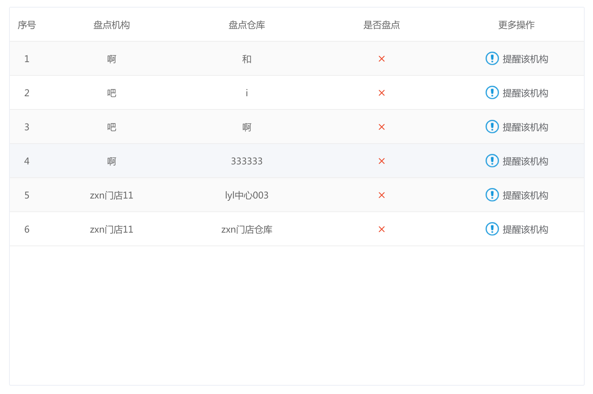

### Table组件列宽度计算优化

​		背景：现有table组件在所有列的宽度和小于tbody的宽度时，会对所有列进行宽度平均分配的计算操作，此计算导致所有列的宽度相同，当需求某一列较宽或者较窄时，难以实现。

​		鉴于以上情况，现将所有列宽度和小于tbody宽度时对列宽度重新计算的算法进行优化。

算法原代码：

```javascript
const columnArr = this.columnArr.filter(item => {
	return !FIXED_WIDTH_COLUNM.includes(item.type)
})
const fixWidth = this.columnArr.filter(item => {
	return FIXED_WIDTH_COLUNM.includes(item.type)
}).reduce((pre, cur) => {
	return pre + cur.columnConfig.realWidth
}, 0)
const contentColWidth = this.$refs.tbody.$el.clientWidth - fixWidth
const width = parseInt(contentColWidth / columnArr.length, 10)
const firstWidth = contentColWidth - (width * (columnArr.length - 1))
const firstColIndex = this.columnArr.filter(colItem => {
	return FIXED_WIDTH_COLUNM.includes(colItem.type)
}).length
this.columnArr.forEach((item, index) => {
	if (firstColIndex === index) {
		item.columnConfig.realWidth = firstWidth
	} else if (!FIXED_WIDTH_COLUNM.includes(item.type)) {
		item.columnConfig.realWidth = width
	}
})

```

原理：将除去固定宽度列的列宽度进行平均分配，除不尽的增加/减少到第一列（除去固定宽度列）

效果截图：




优化后的代码：

```javascript
const columnArr = this.columnArr.filter(item => {
	return !FIXED_WIDTH_COLUNM.includes(item.type)
})
const contentColWidth = this.$refs.tbody.$el.clientWidth
const diffValue = contentColWidth - this.colWidthSum
const diffWidth = parseInt(diffValue / columnArr.length, 10)
const firstDiffWidth = diffValue - (diffWidth * (columnArr.length - 1))
const firstColIndex = this.columnArr.filter(colItem => {
	return FIXED_WIDTH_COLUNM.includes(colItem.type)
}).length
this.columnArr.forEach((item, index) => {
	if (firstColIndex === index) {
		item.columnConfig.realWidth = item.columnConfig.width + firstDiffWidth
	} else if (!FIXED_WIDTH_COLUNM.includes(item.type)) {
		item.columnConfig.realWidth = item.columnConfig.width + diffWidth
	}
})
```

原理：首先根据除去固定宽度列的各列设置的宽度（未设置默认为150）的和，算出与tbody宽度的差值，再对差值进行平均分配，固定宽度列不参与分配，除不尽的差值增加/减少到第一列（除去固定宽度列）

效果截图：


