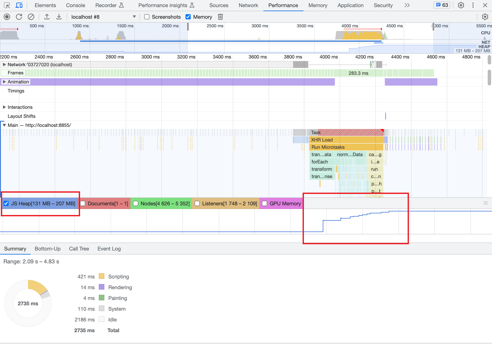

### Vue2数据优化之Object.freeze

**优化背景：**

​		SCM8移动端项目是通过web-view嵌入微信小程序当中。一旦数据量过大，会导致内存占用过大，以至于微信小程序刷新web-view导致页面自动刷新，给用户带来不好的体验。

```javascript
wx.onMemoryWarning(function listener) // 微信小程序，监听内存不足告警事件。

onLoad: function (options) {
   wx.onMemoryWarning(function () {
   		console.log('onMemoryWarningReceive')
   })
}
```


优化前：

```javascript
data () {
  return {
    itemList: [],
    currentItemsList: []
  }
},
methods: {
  add (itemList) {
	  this.itemList = itemList
    ......
    this.currentItemsList = this.itemList.slice(0, end)
  }
}
```


​		在Vue2中，当你把一个普通的 JavaScript 对象传入 Vue 实例作为 `data` 选项，Vue 将遍历此对象所有的 property，并使用 `Object.defineProperty` 把这些 property 全部转为 getter/setter。


**Object.freeze()方法简介：**

​		`Object.freeze()` 是 JavaScript 中的一个方法，它用于冻结一个对象，使其不可修改。当一个对象被冻结后，任何尝试修改其属性或方法的操作都会被阻止。

​		使用 `Object.freeze()` 方法可以确保对象的状态不被意外修改，提高程序的安全性和稳定性。冻结的对象不可添加、删除或修改属性，也不能修改已有属性的值，同时它的原型链也被冻结。

下面是一个示例：

```javascript
const obj = {
  prop1: 'value1',
  prop2: 'value2'
};

Object.freeze(obj);

// 尝试修改属性的操作都会被阻止
obj.prop1 = 'new value'; // 不会生效，仍然是 'value1'
delete obj.prop2; // 不会生效，属性仍然存在

console.log(obj.prop1); // 输出 'value1'
console.log(obj.prop2); // 输出 'value2'

```

​		需要注意的是，`Object.freeze()` 只会冻结对象本身的属性和方法，而不会递归地冻结其嵌套对象。如果需要递归地冻结对象及其嵌套对象，可以编写自定义的递归函数来实现。

```javascript
const obj = {
  prop1: 'value1',
  prop2: {
    a: 1,
    b: 2
  },
  prop3: [1, 2, 3]
};

Object.freeze(obj);

obj.prop2.a = 3; // 此修改会生效
obj.prop3.push(4); // 此修改会生效

console.log(obj.prop2); // 输出 {a: 3, b: 2}
console.log(obj.prop3); // 输出 [1, 2, 3, 4]
```

**Vue2对于冻结对象的处理：**

​		`Object.isFrozen()` 是 JavaScript 中的一个方法，用于检查一个对象是否被冻结（immutable）。

​		递归遍历一个对象以调用所有转换过的getter，这样对象中的每个嵌套属性都被收集为“深层”依赖项。


**优化后：**

```javascript
data () {
  return {
    itemList: [],
    currentItemsList: []
  }
},
methods: {
  add (itemList) {
	  this.itemList = Object.freeze(itemList)
    ......
    this.currentItemsList = this.itemList.slice(0, end)
  }
}
```


**Vue3项目中：**

​		在Vue3中，使用了 Proxy 来创建响应式对象，从而实现基本操作的拦截和自定义（如属性查找、赋值、枚举、函数调用等）。


```javascript

const itemDetailsList = ref([])
......
const add = (itemList) => {
  itemDetailsList.value = itemList
}

```

