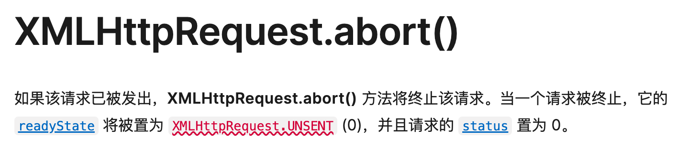

### axios 支持请求取消能力，这是如何实现的呢?

每次发送请求都需要创建一个新的 CancelToken 对象

将 CancelToken 对象中的 token 作为 config 传入 axios 请求中

当请求被取消时，Axios 会抛出一个类型为 Cancel 的错误，您可以使用 axios.isCancel(error) 来检查是否是取消错误。

当需要取消请求时，调用 CancelToken 对象的 cancel 方法

