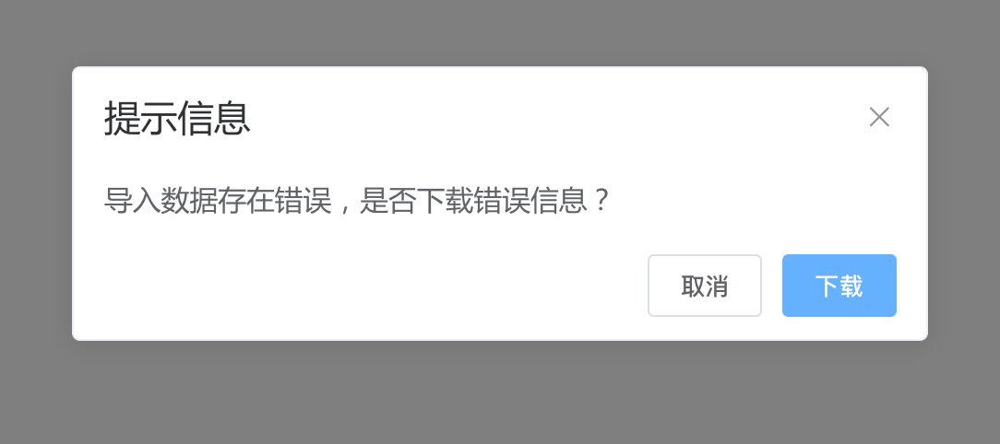

### 后端返回文件流或者json数据

​		在实际业务中，由于调用导入excel文件接口后，后端对导入的excel文件进行校验；如有错误，后端则返回带有错误信息的流形式的excel文件；如导入成功，后端则返回导入成功的json数据。

​		所以，我们需要将responseType设置为“arraybuffer”对文件流进行接收；如果后端返回的是json数据，因为我们设置的responseType为“arraybuffer”，所以需要将其进行转换为js对象格式。

**Axios 响应拦截器中对responseType为“arraybuffer”的响应数据进行处理**

```javascript
const responseInterceptors = [
	res => {
    ...
		let response = res.data
		if (res.config.responseType === 'arraybuffer') {
      // 判断返回的数据是否为文件流
			if (!res.headers['content-disposition']) {
        // 返回的数据不为文件流
        // 定义一个文本解码器（utf-8格式）
				const enc = new TextDecoder('utf-8')
        // 将ArrayBuffer类型的response数据转换为Uint8Array类型，并通过文本解码器进行解码，再通过封装的JSONparse转换为js对象
				response = app.vue.$fxUtils.JSONparse(enc.decode(new Uint8Array(response)), 'object')
        // 判断是否转换成功，不成功就再转换一遍
				if (typeof response !== 'object') {
					response = app.vue.$fxUtils.JSONparse(response, 'object')
				}
			} else {
        // 返回的数据是文件流，不做处理，待后续用downloadFile方法处理
				return res
			}
		}
    ...
	},
	error => {
    ...
			let errData = error.response.data
			if (error.config.responseType === 'arraybuffer') {
				const enc = new TextDecoder('utf-8')
				errData = app.vue.$fxUtils.JSONparse(enc.decode(new Uint8Array(errData)))
			}
			serviceError = errData
		...
		return Promise.reject(serviceError)
	}
]
```

**utils.js文件里面增加downloadFile下载文件的方法**

```javascript
// 后端返回文件流下载文件
const downloadFile = function (fileData, fileName = `excel-${new Date().getTime()}`) {
  const Temp = document.createElement('a')
  if (fileData.headers) {
    const disposition = fileData.headers['content-disposition']
    // 提取文件名
    fileName = decodeURIComponent(disposition.substring(disposition.indexOf('filename=') + 9, disposition.length))
    fileData = fileData.data
  }
  // 将后端返回的ArrayBuffer格式数据转换为Blob类型对象，格式指定为excel文件
  const blob = new Blob([fileData], { type: 'application/vnd.openxmlformats- officedocument.spreadsheetml.sheet;charset=utf-8' })
  // 根据blob对象使用URL.createObjectURL方法创造一个对象URL，该URL可用于指定源blob对象的内容
  Temp.href = window.URL.createObjectURL(blob)
  Temp.download = fileName
  Temp.click()
  Temp.remove()
}
```

**downloadFile方法在业务中的使用**

```javascript
confirmWrongData (res) {
      if (!res.result) {
        this.$fxConfirm({
          message: '导入数据存在错误，是否下载错误信息？',
          option: {
            confirmButtonText: '下载',
            cancelButtonText: '取消'
          }
        }).then(() => {
          // 调用downloadFile方法
          this.$fxUtils.downloadFile(res)
        })
      } else {
        // 成功则直接刷新数据，不调用downloadFile方法
        this.onDetailsRefresh()
      }
    }
```

**效果展示：**

存在错误信息，点击下载则可以下载后端返回的excel文件；点击取消则不进行操作



导入成功则弹出提示，并刷新数据


