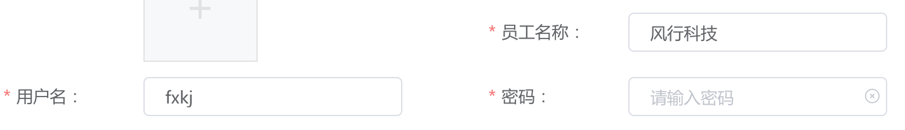
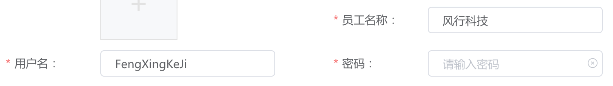

### 将汉字转换为拼音

​		在业务中，我们需要将输入的汉字进行转换为拼音全拼或者首字母，优化用户的体验。

​		根据正则匹配输入内容中的字母、数字和汉字；如果是英文字母和数字，则不进行转换，直接拼接字符串；如果是汉字，则对汉字进行转换，根据拼音库找到汉字对应的拼音，再根据方法第二个参数（true/false）返回首字母或者首字母大写的全拼。

[\u4e00-\u9fa5]表示Unicode表中的汉字的头和尾，即表示全部的汉字

**string.js文件里面增加chinese2Pinyin汉字转换为拼音的方法**

```javascript
// 导入拼音库
import PINYIN_LIBRARY from './pinyin_library.js'
// 汉字转拼音(全拼/简拼)
const chinese2Pinyin = function (val, simple = false) {
	return split(val, '').reduce((pre, cur) => {
		if (regUtils.regInitByType(['english', 'number']).test(cur)) {
			pre += cur
		} else if (regUtils.regInitByType('chinese').test(cur)) {
			const name = getFirstLetter(cur, simple)
			pre += name
		}
		return pre
	}, '')
}
// 根据字典查找对应的拼音
const getFirstLetter = function (val, simple) {
	const [first] = [...val]
	for (var name in PINYIN_LIBRARY) {
		if (~PINYIN_LIBRARY[name].indexOf(first)) {
			return ucfirst(name, simple)
		}
	}
	return ''
}
// 返回拼音首字母或者拼音首字母大写
const ucfirst = function (l1, simple) {
	if (l1.length > 0) {
		if (simple) return l1.substr(0, 1)
		const first = l1.substr(0, 1).toUpperCase()
		const spare = l1.substr(1, l1.length)
		return first + spare
	}
	return ''
}
```

**拼音查询的库pinyin_library.js**

```javascript
export default {
	a: '\u554a\u963f\u9515',
	ai: '\u57c3\u6328\u54ce\u5509\u54c0\u7691\u764c\u853c\u77ee\u827e\u788d\u7231\u9698\u8bf6\u6371\u55f3\u55cc\u5ad2\u7477\u66a7\u7839\u953f\u972d',
	an: '\u978d\u6c28\u5b89\u4ffa\u6309\u6697\u5cb8\u80fa\u6848\u8c19\u57ef\u63de\u72b4\u5eb5\u6849\u94f5\u9e4c\u9878\u9eef',
	ang: '\u80ae\u6602\u76ce',
	ao: '\u51f9\u6556\u71ac\u7ff1\u8884\u50b2\u5965\u61ca\u6fb3\u5773\u62d7\u55f7\u5662\u5c99\u5ed2\u9068\u5aaa\u9a9c\u8071\u87af\u93ca\u9ccc\u93d6',
	ba: '\u82ad\u634c\u6252\u53ed\u5427\u7b06\u516b\u75a4\u5df4\u62d4\u8dcb\u9776\u628a\u8019\u575d\u9738\u7f62\u7238\u8307\u83dd\u8406\u636d\u5c9c\u705e\u6777\u94af\u7c91\u9c85\u9b43',
	bai: '\u767d\u67cf\u767e\u6446\u4f70\u8d25\u62dc\u7a17\u859c\u63b0\u97b4',
	ban: '\u6591\u73ed\u642c\u6273\u822c\u9881\u677f\u7248\u626e\u62cc\u4f34\u74e3\u534a\u529e\u7eca\u962a\u5742\u8c73\u94a3\u7622\u764d\u8228',
	bang: '\u90a6\u5e2e\u6886\u699c\u8180\u7ed1\u68d2\u78c5\u868c\u9551\u508d\u8c24\u84a1\u8783',
	bao: '\u82de\u80de\u5305\u8912\u96f9\u4fdd\u5821\u9971\u5b9d\u62b1\u62a5\u66b4\u8c79\u9c8d\u7206\u52f9\u8446\u5b80\u5b62\u7172\u9e28\u8913\u8db5\u9f85'
 ...
}
```

**效果展示：**

简拼



全拼

