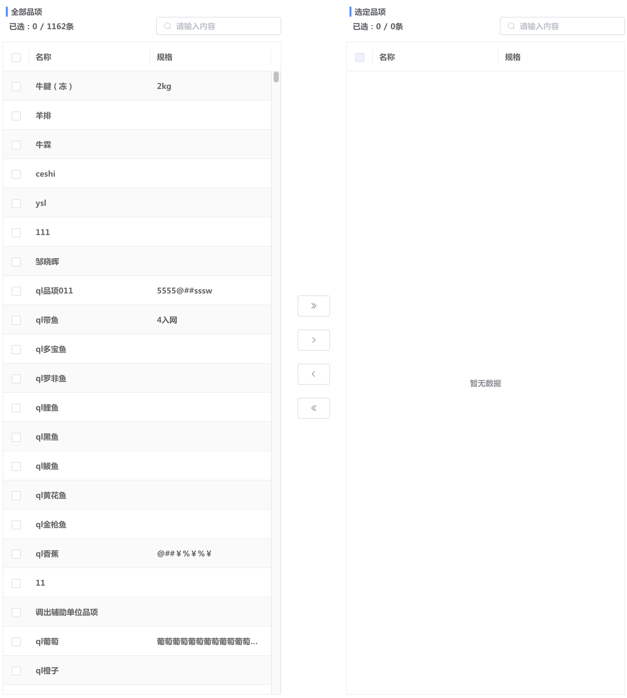
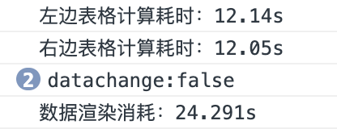
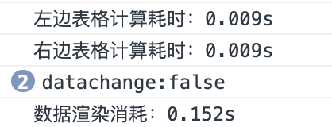

### 穿梭框优化改造

​		背景：现有fx-transfer穿梭框组件是基于el-table表格组件进行渲染，当数据量过大时（比如10000条），页面渲染会直接卡死。

​		鉴于以上情况，现将fx-transfer穿梭框组件内的el-table表格组件改为以w-virtual-table为基础的fx-list-virtual-table组件，解决数据量过大导致页面卡死的情况。

​		在将table组件更换后，数据量过大渲染问题得到解决，但发现新的问题：

​				1、当右侧表格数据较多时，输入框筛选会变慢；

​				2、数据量较大的穿梭会等待较长时间。



**对于问题1、当右侧表格数据较多时，输入框筛选会变慢**

原代码：

```javascript
computed: {
		......
		unSelectTableData () {
			return this.tableDataComputed.filter(item => {
				return !this.value.includes(item.id) && this.$fxUtils.fuzzyQueryObj(item, this.unSelectTableSearchKey, this.searchProps)
			})
		},
		selectTableData () {
			return this.tableDataComputed.filter(item => {
				return this.value.includes(item.id) && this.$fxUtils.fuzzyQueryObj(item, this.selectTableSearchKey, this.searchProps)
			})
		}
	},
```

优化后的代码：

```javascript
computed: {
		......
		unSelectTableData () {
			return this.tableDataComputed.filter(item => {
				return !this.value.includes(item.id)
			})
		},
		selectTableData () {
			return this.tableDataComputed.filter(item => {
				return this.value.includes(item.id)
			})
		},
		unSelectTableDataComputed () {
			return this.unSelectTableData.filter(item => {
				return this.$fxUtils.fuzzyQueryObj(item, this.unSelectTableSearchKey, this.searchProps)
			})
		},
		selectTableDataComputed () {
			return this.selectTableData.filter(item => {
				return this.$fxUtils.fuzzyQueryObj(item, this.selectTableSearchKey, this.searchProps)
			})
		}
	},
```

原理：将输入框筛选功能独立出来，避免在触发输入框筛选时也同时触发this.value.includes()的运算

**对于问题2、数据量较大的穿梭会等待较长时间**

原代码：

```javascript
computed: {
		......
		unSelectTableData () {
			return this.tableDataComputed.filter(item => {
				return !this.value.includes(item.id)
			})
		},
		selectTableData () {
			return this.tableDataComputed.filter(item => {
				return this.value.includes(item.id)
			})
		},
		unSelectTableDataComputed () {
			return this.unSelectTableData.filter(item => {
				return this.$fxUtils.fuzzyQueryObj(item, this.unSelectTableSearchKey, this.searchProps)
			})
		},
		selectTableDataComputed () {
			return this.selectTableData.filter(item => {
				return this.$fxUtils.fuzzyQueryObj(item, this.selectTableSearchKey, this.searchProps)
			})
		}
	},
```

通过处理可以得到两个表格数据处理所需要的时间，代码如下：

```javascript
computed: {
		......
		unSelectTableData () {
			const start = new Date().getTime()
			const data = this.tableDataComputed.filter(item => {
				return !this.value.includes(item.id)
			})
			console.log(`左边表格计算耗时：${(new Date().getTime() - start) / 1000}s`)
			return data
		},
		selectTableData () {
			const start = new Date().getTime()
			const data = this.tableDataComputed.filter(item => {
				return this.value.includes(item.id)
			})
			console.log(`右边表格计算耗时：${(new Date().getTime() - start) / 1000}s`)
			return data
		},
		unSelectTableDataComputed () {
			return this.unSelectTableData.filter(item => {
				return this.$fxUtils.fuzzyQueryObj(item, this.unSelectTableSearchKey, this.searchProps)
			})
		},
		selectTableDataComputed () {
			return this.selectTableData.filter(item => {
				return this.$fxUtils.fuzzyQueryObj(item, this.selectTableSearchKey, this.searchProps)
			})
		}
},
    
methods: {
    ......
    onSelectAll () {
			const selecteds = this.unSelectTableDataComputed.map(item => {
				return item.id
			})
			this.$emit('input', [...this.value, ...selecteds])
			this.defaultUnSelect = []
			const start = new Date().getTime()
			this.$nextTick(() => {
				console.log(`数据渲染消耗：${(new Date().getTime() - start) / 1000}s`)
			})
		},
      ......
}
```

选择10000条数据进行穿梭所需时间如下：



原因：filter方法内嵌套includes方法，导致计算量增大，所需时间较长。

优化后代码如下：

```javascript
computed: {
		......
		unSelectTableData () {
			return this.tableDataComputed.filter(item => {
				return !this.compareArrayUtils.has(item.id)
			})
		},
		selectTableData () {
			return this.tableDataComputed.filter(item => {
				return this.compareArrayUtils.has(item.id)
			})
		},
		......
	},
    
watch: {
		......
		value: {
			immediate: true,
			handler (val) {
				this.compareArrayUtils.setData(val)
			}
		}
	},
    
data () {
	return {
    ......
		compareArrayUtils: this.$fxUtils.compareArrayUtils()
	}
},
```

```javascript
class CompareArrayUtils {
	constructor (data, config) {
		this.compareData = new Map()
		if (data) {
			this.setData(data, config)
		}
	}

	setData (arr, config = {}) {
		this.compareData = new Map()
		arr.forEach(item => {
			config.key ? this.compareData.set(getObjDeepValue(item, config.key), item) : this.compareData.set(item, item)
		})
	}

	has (val) {
		return this.compareData.has(val)
	}

	get (val) {
		return this.compareData.get(val)
	}
}

const compareArrayUtils = function () {
	return new CompareArrayUtils(...arguments)
}
```

原理：将已选中的数据（右侧数据）id数组转化为一个Map对象（id：id形式），将数组的includes方法替换为Map对象的has方法，从而提高计算效率，减少计算消耗的时间

优化后，选择10000条数据进行穿梭所需时间如下：

|  |  |
| :----------------------------------------------------------: | :----------------------------------------------------------: |
|                            优化前                            |                            优化后                            |

